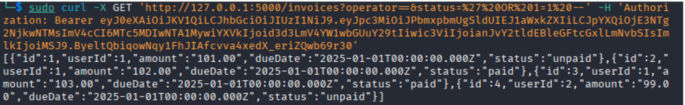
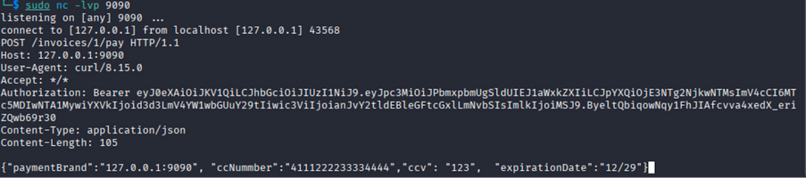
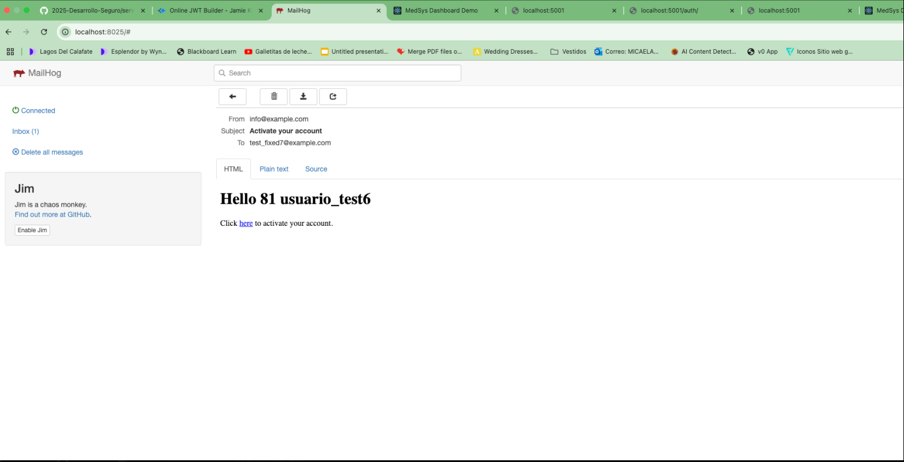
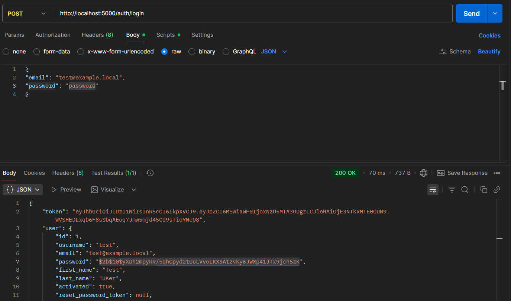

# Consigna Práctica 2 - Mitigación de Vulnerabilidades de CWE 
**Juliana Hernández, Micaela Procofio y Mauro Barrales**

**Aclaración**

1. Varias de estas vulnerabilidades se explotaron utilizando el user Test, que tiene el userId: 1
2. Para correr con la variable de entorno ejecutar en la terminal: `export JWT_SECRET="mi_jwt_secret_super_seguro_2024" &&  docker compose up -d`
El archivo con la variable de entorno debe de estar ubicado en services/backend/.env: con el siguiente secrfet:
`JWT_SECRET=varaible de entorno`

## 1 - Inyección SQL 

**Justificación**

En la función getReceipt que se encuentra en invoiceService, los parámetros status y operator se concatenan directamente en la consulta de SQL. Esto es una vulnerabilidad ya que un atacante puede inyectar código de SQL malicioso.

**Componente afectado:** `services/backend/src/services/invoiceService.ts`

**Parametro afectado:** let q

```typescript
class InvoiceService {
  static async list( userId: number, status?: string, operator?: string): Promise<Invoice[]> {
    let q = db<InvoiceRow>('invoices').where({ userId: userId });
    if (status) q = q.andWhereRaw(" status "+ operator + " '"+ status +"'");                    
    const rows = await q.select();
    const invoices = rows.map(row => ({
      id: row.id,
      userId: row.userId,
      amount: row.amount,
      dueDate: row.dueDate,
      status: row.status} as Invoice
    ));
    return invoices;
  }
  ```

Esto es vulnerable ya que se utiliza directamente la concatenación de strings.

**PoC**

Siguiendo los siguientes pasos se puede reproducir la vulnerabilidad:

1- Entrar en la terminal de la computadora al servicio de backend

2- Ejecutar el siguiente comando: 
`curl -X GET 'http://localhost:5000/invoices?operator==&status=%27%20OR%201=1%20--' -H 'Authorization: Bearer <token generado anteriormente>'
`

3- Respuesta con JSON con datos de las facturas:


**Fix**

Para arreglar la vulnerabilidad dejamos de concatenar los strings en la consulta. Lo que hicimos fue usar Knex para manejar los datos.
Realizamos estos 2 cambios:

1- Validamos la entrada del operador creando una lista con los operadores permitidos, de no ser un operador valido la consulta no se procesa.

2- Usamos consultas parametrizadas cambiando el `.andWhereRaw()` por un `.andWhere()`. Con este cambio no se va a ejecutar directamente lo que ingresa el usuario.

```typescript
static async list(userId: number, status?: string, operator?: string): Promise<Invoice[]> {
    const q = db<InvoiceRow>('invoices').where({ userId: userId });
//  if (status) q = q.andWhereRaw(" status "+ operator + " '"+ status +"'");                    // sql injection
    if (status && operator) {
      const allowedOperators = ['=', '!=', '>', '<', '>=', '<='];
      if (allowedOperators.includes(operator)) {
        q.andWhere('status', operator, status);
      } else {
        throw new Error('Operador no válido');
      }
    }
    
    const rows = await q.select();
    const invoices = rows.map(row => ({
      id: row.id,
      userId: row.userId,
      amount: row.amount,
      dueDate: row.dueDate,
      status: row.status
    } as Invoice));

    return invoices;
  }
```

## 2 - Hard Coded Credentials

**Justificación**

Se encuentra hardcodeado en el código el secreto que se utiliza para firmar los JWT. 
Esto es una vulnerabilidad ya que cualquiera que tenga acceso al código, sea externo o interno a la empresa, puede obtener ese secreto y generar tokens de acceso válidos para cualquier usuario y tomar el control de las cuentas

**PoC**

Siguiendo los siguientes pasos se puede reproducir la vulnerabilidad:

1. Entrar a la pagina http://jwtbuilder.jamiekurtz.com/ 

2. Ir a la parte de “Additional Claims” y borrar todo.
3. Agregar lo siguiente:
    Claim Type : id 
    Value: 1
4. Ir a la sección “Signed JSON Web Token” y en la parte de key poner el siguiente valor “secreto_super_seguro”
5. Darle al boton “Created Signed JWT” y copiar el token.
6. Ir al navegador 
7. Entrar a la url http://localhost:3000/login 
8. Entrar a las herramientas de desarrollo (F12)
9. Ir a la sección de storage
10. Seleccionar LocalStorage e ingresar al la url del localhost
11. Ver si existe algún valor, si existe modificar el token que se encuentra ahi por el token creado. De no existir, darle al más y agregar en Key el valor “token” y en Value poner el token.
12. Hacer refresh a la url y intentar entrar a http://localhost:3000/home 

**Fix**
Externalizamos el secreto del código fuente, utilizando variables de entorno.
  1.  Creamos un archivo `.env` en el directorio del backend (`services/backend`) para almacenar el `JWT_SECRET` fuera del control de versiones.
  2.  Se verificó que el archivo `.gitignore` incluyera una entrada para `.env`, asegurando que este archivo nunca sea commiteado al repositorio de Git.
  3.  Se implementó un módulo de configuración centralizado (`src/config/index.ts`) encargado de cargar las variables de entorno al iniciar la aplicación, utilizando la librería `dotenv`.
  4.  Se refactorizaron todos los archivos que utilizaban el secreto hardcodeado (`jwt.ts`, `auth.middleware.ts`, `authService.test.ts`) para que importaran el secreto desde el módulo de configuración central, eliminando por completo el valor del código fuente.


## 3 - Server Side Request Fogery - SSRF

**Justificación**
En el invoiceService, la función setPaymentCard construye una URL usando el parámetro paymentBrand que le envía el usuario. Esto es una vulnerabilidad ya que un atacante puede usar esto para hacer que el servidor realice peticiones a otros servicios dentro de la red interna

**Componente Afectado:** `services/backend/src/services/invoiceService.ts`

**Parametro Afectado:** `const paymentResponse` 

```typescript
 const paymentResponse = await axios.post(`http://${paymentBrand}/payments`, {
      ccNumber,
      ccv,
      expirationDate
    });
    if (paymentResponse.status !== 200) {
      throw new Error('Payment failed');
    }
```

**PoC**
Siguiendo los siguientes pasos se puede reproducir la vulnerabilidad:

1. Abrir una terminal y ejecutar el siguiente comando. Esté comando lo que hace es poner a escuchar a nuestro servidor malicioso :`nc -lvp 9090`

2. Ir a la terminal donde tenemos abierto el proyecto de backend y ejecutar:
`curl -X POST http://localhost:5000/invoices/1/pay
 -H "Authorization: Bearer <token generado anteriormente>"
-H "Content-Type: application/json" 
-d '{
  "paymentBrand": "127.0.0.1:9090",
  "ccNumber": "4111222233334444",
  "ccv": "123",
  "expirationDate": "12/29"
}'`
3. Volver a la terminal que estaba escuchando y se puede observar que escucho el post que realizamos



**Fix**
Para eliminar esta vulnerabilidad, se implementó una validación del lado del servidor basada en una lista blanca (allowlist) de destinos permitidos. El sistema ya no confía en la entrada del usuario para construir la URL, sino que la usa como un identificador para seleccionar una URL segura y predefinida.

1.  Se definió un objeto constante (`PAYMENT_GATEWAY_URLS`) que funciona como un diccionario, mapeando identificadores de marcas de tarjeta permitidas (ej: `"visa"`) a sus URLs de servicio completas y seguras (ej: `'http://visa-payments.internal-api/pay'`).
2.  Se modificó la función `setPaymentCard` para que, en lugar de concatenar el `paymentBrand` del usuario, lo utilice como una clave para buscar en el objeto `PAYMENT_GATEWAY_URLS`.
3.  Se añadió una validación explícita: si el `paymentBrand` proporcionado por el usuario no existe como clave en la lista blanca, la petición es rechazada con un error `400 Bad Request` y no se realiza ninguna llamada de red.


## 4 - Path Traversal

**Justificación**
La funcionalidad para descargar archivos no valida correctamente la ruta del archivo, lo que hace que esté permitido el uso de caracteres como ../. Esto es una vulnerabilidad ya que el atacante puede navegar por distintas partes del directorio y puede llegar a leer archivos de configuración sensibles o archivos del sistema operativo.

**Componentes afectados:** 
`src/controllers/invoiceController.ts → getInvoicePDF`

`src/services/invoiceService.ts → InvoiceService.getReceipt`

**Endpoint vulnerable:**
`GET /invoices/:id/invoice`

**Parametro vulnerable:** `pdfName`

```typescript
static async getReceipt(
    invoiceId: string,
    pdfName: string
  ) {
    // check if the invoice exists
    const invoice = await db<InvoiceRow>('invoices').where({ id: invoiceId }).first();
    if (!invoice) {
      throw new Error('Invoice not found');
    }
    try {
      const filePath = `/invoices/${pdfName}`;
      const content = await fs.readFile(filePath, 'utf-8');
      return content;
    } catch (error) {
      // send the error to the standard output
      console.error('Error reading receipt file:', error);
      throw new Error('Receipt not found');

    } 
```

**PoC**
Siguiendo los siguientes pasos se puede reproducir la vulnerabilidad:

1. En Postman hacer el siguiente request:
`GET 'http://localhost:5000/invoices/1/invoice?pdfName=../../../../../../../../../../etc/passwd`
2. Muestra nombres de usuarios e IDs válidos además de estructura del sistema con los directrorios home y shells de acceso /bin/bash


**Fix**
Para arrelgar la vulnerabilidad, utilizamos la estrategía es la de validación de ruta canónica.

Pusimos una variable llamada `INVOICE_DIRECTORY` para asegurarnos de que la ruta solicitada nunca salga del directorio base usando path.resolve(). 

```typescript
const INVOICES_DIRECTORY = path.resolve(__dirname, '..', '..', 'invoices_data');
```
En la función `getReceipt` se usa path.join para construir la ruta de fomra segura como lo dimos en clase, normalizando automaticamente la ruta y eliminando secuencias ../ que intenten escapar del directorio actual. 

En la variable 
```typescript
const requestFilePath = path.join(INVOICES_DIRECTORY, pdfName);
```
 Se verifica usando startsWith() que la ruta de requestFilePath, siempre coincida con el directorio actual, de los contrario se rechaza la solicitud. 


```typescript
static async getReceipt(
    invoiceId: number,   // cambio a number
    pdfName: string,
    userId: number
  ) {
    // check if the invoice exists
    const invoice = await db<InvoiceRow>('invoices').where({id: invoiceId, userId: userId}).first();
    if (!invoice) {
      throw new Error('Factura no encontrada o usuario  no autorizado'); //Aviso de error
    }

    const requestFilePath = path.join(INVOICES_DIRECTORY, pdfName)

    if (!requestFilePath.startsWith(INVOICES_DIRECTORY)) { //fix
      throw new Error('Error, no puede acceder fuera del directorio predeterminado'); // Aviso de error
    }

    try {
      const content = await fs.readFile(requestFilePath, 'utf-8');  //fix para la vulnerabilidad
      return content;
    } catch (error) {
      // send the error to the standard output
      console.error('Error reading receipt file:', error);
      throw new Error('Receipt not found');
    } 
```

## 5 - Missing Authorization

Los endpoints que devuelven las facturas no verifican que el usuario autenticado sea el propietario de las facturas. Se permite buscar facturas sólo filtrando por invoiceId, permitiendo a otros usuarios acceder a facturas ajenas. 

**Componentes afectados**
src/routes/invoices.routes — rutas sin protección de autenticación

src/controllers/invoiceController.getInvoicePDF — no válida propiedad

src/services/invoiceService.getReceipt — no valida propiedad

src/services/invoiceService.getInvoice — consultas inseguras que no incluyen userId

**Endpoints inseguros**

```typescript
//GET /invoices
router.get('/', routes.listInvoices);`
// GET /invoices/:id
router.get('/:id', routes.getInvoice);
// POST /invoices/:id/pay
router.post('/:id/pay', routes.setPaymentCard);
router.get('/:id/invoice', routes.getInvoicePDF);
```

**PoC**
Tabla de Invoices:

```bash
SELECT * FROM invoices;

 id | userId | amount |  dueDate   | status 
----+--------+--------+------------+--------
  1 |      1 | 101.00 | 2025-01-01 | unpaid
  2 |      1 | 102.00 | 2025-01-01 | paid
  3 |      1 | 103.00 | 2025-01-01 | paid
  4 |      2 |  99.00 | 2025-01-01 | unpaid
```

Un usuario autenticado con userId 1 hace el siguiente request: 

`GET http://localhost:5000/inovices/4` y obtiene la siguiente respuessta:
```json
{
  "id": 4,
  "userId": 2,
  "amount": "99.00",
  "dueDate": "2025-01-01T00:00:00.000Z",
  "status": "unpaid"
}
```
Esto demuestra la vulnerabilidad ya que el usuario que realiza el request tiene el userId:1 y puede ver la invoice 4 que pertenece a userId:2

**Fix**

1. **Requerir autenticación en las rutas:** Agregar el `authenticateJWT` en las rutas para asegurar que siempre tengamos el userId del usuario autenticado
```typescript
// se agrega authenticateJWT
// GET /invoices
router.get('/', authenticateJWT, routes.listInvoices);
// GET /invoices
router.get('/:id', authenticateJWT, routes.getInvoice);
// POST /invoices/:id/pay
router.get('/:id/invoice', authenticateJWT, routes.getInvoicePDF);
router.post('/:id/pay', authenticateJWT, routes.setPaymentCard);
```
2. **Verificar userId en las consulta del Service:** Cuando se busque una factura, incluir el userId en la condición para asegurar que el recurso perteneza al usuario autenticado. 

```typescript
 static async  getInvoice( invoiceId:number, userId: number): Promise<Invoice> {   // cambio a number
    const invoice = await db<InvoiceRow>('invoices').where({ id: invoiceId, userId: userId }).first();
    if (!invoice) {
      throw new Error('Invoice not found');
    }
    return invoice as Invoice;
  }
```

**Prueba en Postman post fix**

`GET http://localhost:5000/inovices/4`

```json
{
  "message": "Invoice not found"
}
```

## 6 - Server-Side Template Injection

La vulnerabilidad se encuentra `authService`en el método `createUser`. Se usa `${user.first_name} ${user.last_name}` y se  pasa ese string que tiene los datos del usuario a `ejs.render(template)`. Si en la función `ejs.render()` un atacante puede inyectar código EJS valido en los campos `first_name` o `last_name`, la función ejecuta el código en el servidor antes de generar el HTML

```typescript
const template = `
  <html>
    <body>
      <h1>Hello ${user.first_name} ${user.last_name}</h1>
      <p>Click <a href="${ link }">here</a> to activate your account.</p>
    </body>
  </html>`;
const htmlBody = ejs.render(template);
```

**PoC**
En la terminal mandar el siguiente request. 
```bash
curl -v -X POST http://localhost:5001/users \
  -H "Content-Type: application/json" \
  -d '{
    "username": "test_ssti_fixed6",
    "email": "test_fixed6@example.com", 
    "password": "password123",
    "first_name": "<%= 9*9 %>",
    "last_name": "usuario_test6"
  }'
```
En `http://localhost:8025/`  revisar el inbox y aparece:



**Fix**

Para solucionar esta vulnerabilidad SSTI, se implementaron las siguientes medidas de seguridad:

1. **Sanitización de entrada:** Se agregó la librería `validator` para escapar caracteres especiales en los campos `first_name` y `last_name`:

```typescript
import validator from 'validator';

// Validar y sanitizar entrada del usuario para prevenir SSTI
const sanitizedFirstName = validator.escape(user.first_name || '').trim();
const sanitizedLastName = validator.escape(user.last_name || '').trim();
```

2. **Validación de longitud:** Se implementó validación para limitar la longitud de los nombres:

```typescript
if (sanitizedFirstName.length > 50 || sanitizedLastName.length > 50) {
  throw new Error('First name and last name must be less than 50 characters');
}
```

3. **Template seguro con parámetros EJS:** Se cambió la interpolación directa de strings por parámetros seguros de EJS:

```typescript
const template = `
  <html>
    <body>
      <h1>Hello <%= firstName %> <%= lastName %></h1>
      <p>Click <a href="<%= activationLink %>">here</a> to activate your account.</p>
    </body>
  </html>`;

const htmlBody = ejs.render(template, {
  firstName: sanitizedFirstName,
  lastName: sanitizedLastName,
  activationLink: link
});
```

4. **Aplicación en múltiples métodos:** Se aplicó la misma sanitización en el método `updateUser` para consistencia.

5. **Pruebas de seguridad:** Se implementó una prueba específica que verifica que la entrada maliciosa sea correctamente sanitizada:

```typescript
it('createUser should sanitize malicious SSTI input', async () => {
  const user = {
    first_name: '<%= "evil" %>',
    last_name: '<script>alert(1)</script>',
    // ...
  };
  
  expect(insertChain.insert).toHaveBeenCalledWith({
    first_name: '&lt;%= &quot;evil&quot; %&gt;',
    last_name: '&lt;script&gt;alert(1)&lt;&#x2F;script&gt;',
    // ...
  });
});
```

## 7 - Almacenamiento inseguro

La vulnerabilidad sucede porque se guardan las contrasenas en texto plano en la base de datos. Esto es inseguro ya que si un atacante obtiene acceso a la base de datos, podría obtener las contrasenas de los usuarios. 

Además en el endpoint `auth/login` cuando el usuario ingresa sus credenciales, el endpoint devuelve en la respuesta su contrasena. 

**Componente afecado:**
`src/routes/auth.routes.ts`

**Endpoint afectado**
`http://localhost:5000/auth/login`

**PoC**
En postman hacer una solicitud `POST`
`http://localhost:5000/auth/login` mandar el siguiente body:
```json
{
"email": "test@example.local",
"password": "password"
}
```
Respuesta:


**Fix** 
En `authService` se importo la librería de bcrypt para hasear las contrasenas.

En la variable `SALT_ROUNDS` ponemos la cantidad de veces que se debe pasar por la función hash = 10. 

```typescript
static async createUser(user: User) {
    const existing = await db<UserRow>('users')
      .where({ username: user.username })
      .orWhere({ email: user.email })
      .first();
    if (existing) throw new Error('User already exists with that username or email');
    // create invite token
    //Hash de password
    const hashedPassword = await bcrypt.hash(user.password, SALT_ROUNDS); 
    
    const invite_token = crypto.randomBytes(6).toString('hex');
    const invite_token_expires = new Date(Date.now() + INVITE_TTL);
    await db<UserRow>('users')
      .insert({
        username: user.username,
        password: hashedPassword, // Guardado de la contrasena hasheada.
        email: user.email,
        first_name: user.first_name,
        last_name:  user.last_name,
        invite_token,
        invite_token_expires,
        activated: false
      });
```

Además se siguio la misma táctica en las métodos `sendResetPasswordEmail` y `setPassword` y en los métodos de `authService.test.ts`

Prueba con postman de nueva request:

